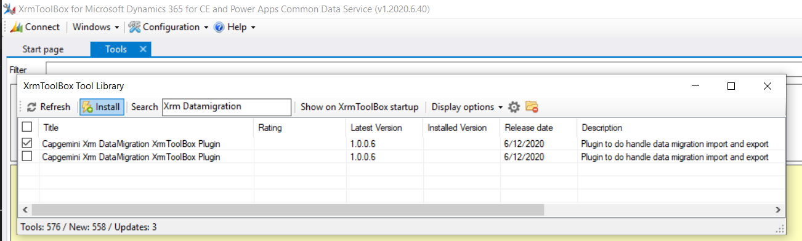
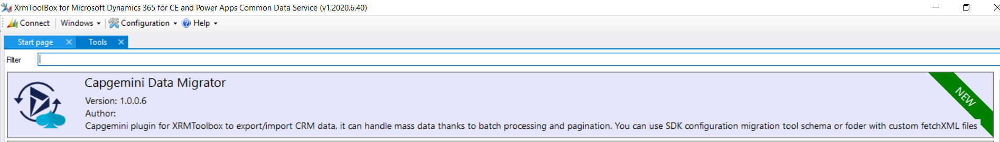
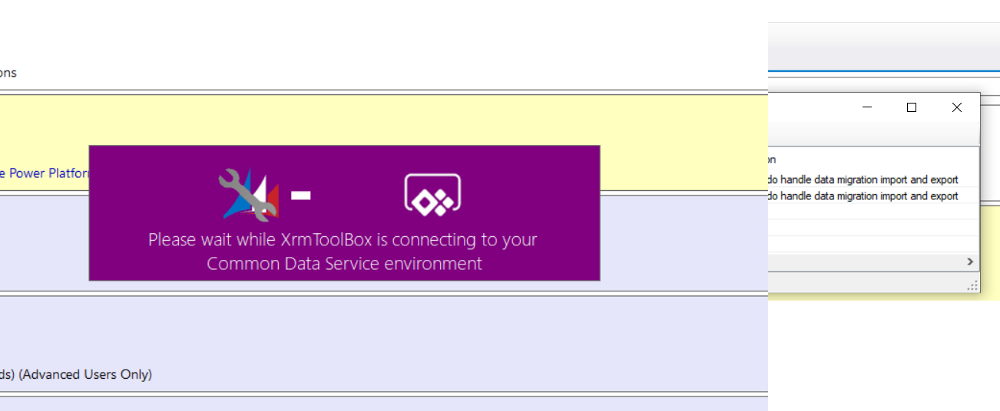
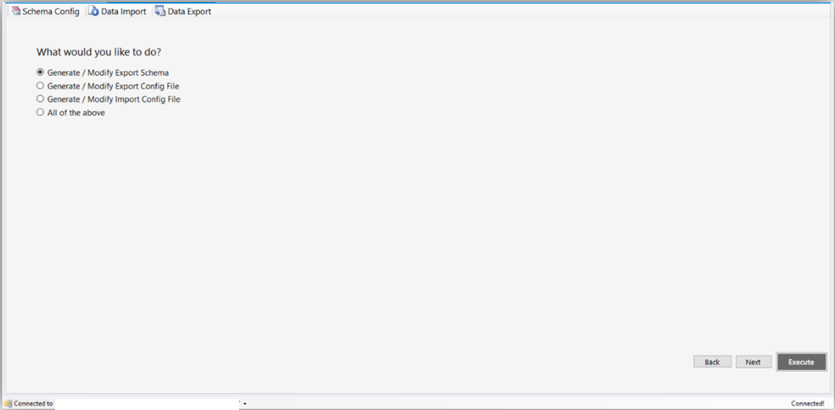
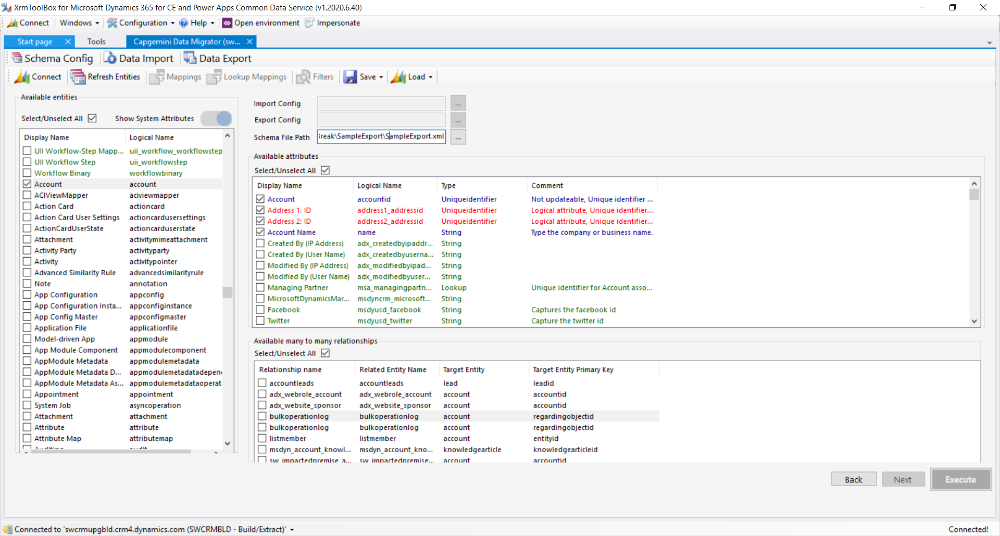
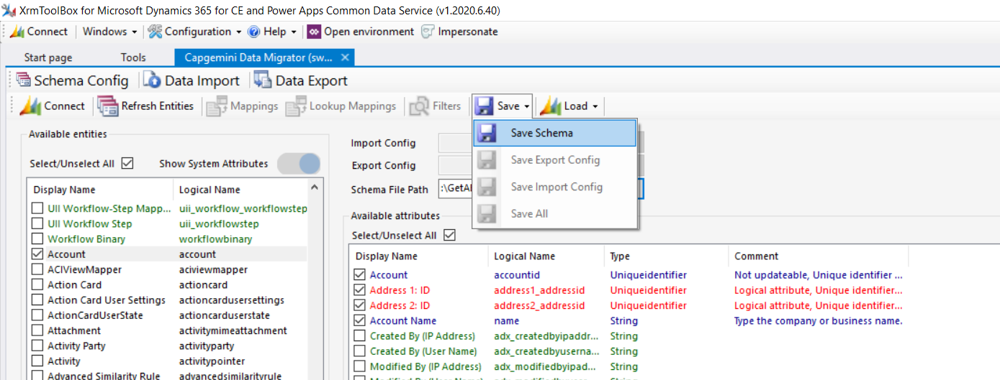

# Xrm Data Migrator

## Content
 - [Introduction](#Introduction)
 - [Installation](#Installation)
 - [Import Export Schema Generation](#Import-Export-Schema-Generation)
 - [Data Export](#Data-Export)
 - [Data Import](#Data-Import)
 
----

Current build status: 

### Introduction
The Xrm Data Migrator plugin provides routines for managing data migration operations within Microsoft Dynamics 365.

### Installation
Before using the Xrm Data Migrator, you will need to install XrmToolBox which can be downloaded from [here](https://www.xrmtoolbox.com/)

Once XrmToolBox is installed, launch it and then select the Tool Library through Configuration menu as shown below:

Then search for "Xrm DataMigration" as shown below:

Install the data migrator.

Once the installation has completed successfully, you will see the Xrm Data Migrator listed in the Tools windows as shown below

Click the data migrator to launch it. You will be prompted for a connection to Dynamics 365 organization as shown in 

Provide valid connection details

The landing page of the data migrator will now be displayed as shown in

### Import Export Schema Generation
The data migrator adhere to a predefined import export schema and the tool can be used to generate the respective schema for import and export. Note that for each of these, both the JSON and CSV formats are supported.
To Generate or modify an export schema, please perforfollow the steps below:
1) Select Generate/Modify Export Schema from the Schema Config tab of the data migrator as shownn in

2) Select the desired entities and attributes combination as shown in
. Please ensure a schema file path is specified as shown in the image
3) Select Save to generate the schema as shown in 
4) Once the export schema is generated, a "Successfully created XML file" dialog will pop up and the export schema XML file will be generated at the specified location. This file will contain all selected entities and their respective selected attributes and relationships 

### Data Export

### Data Import
