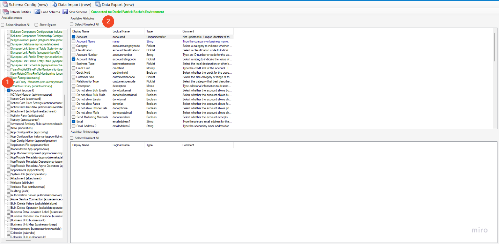
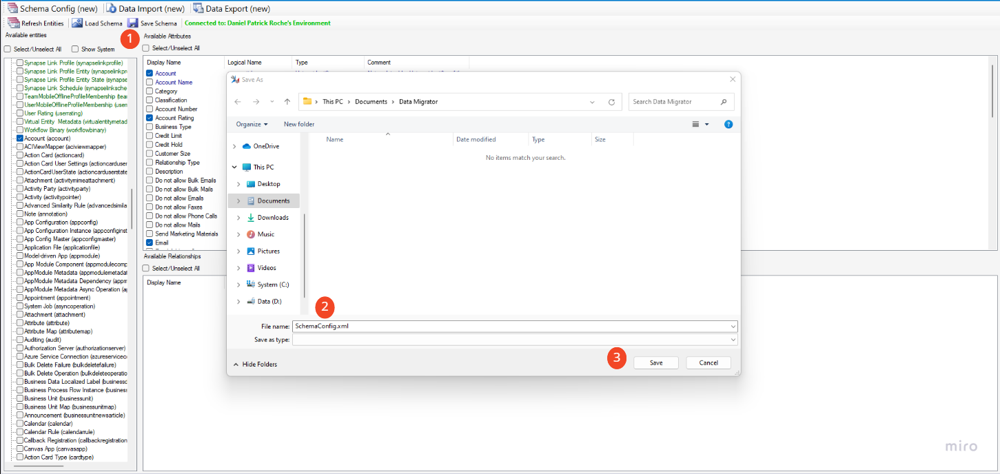
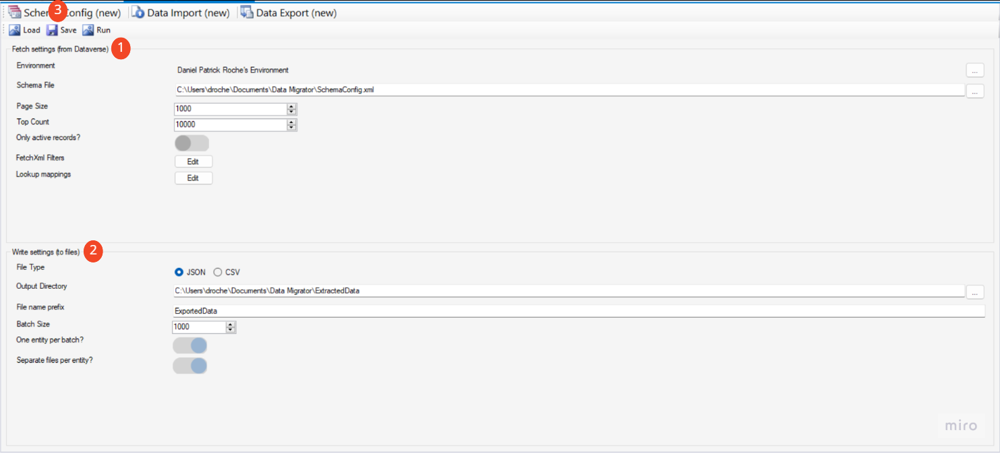
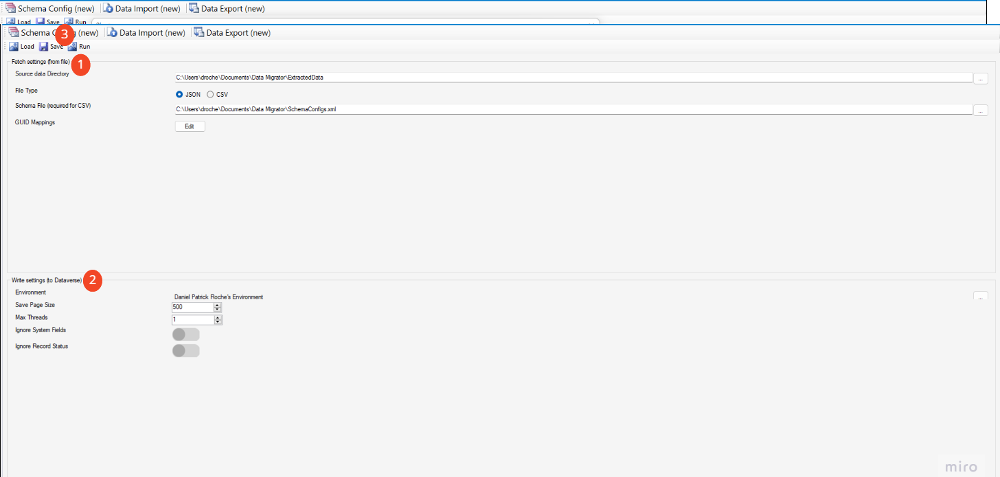
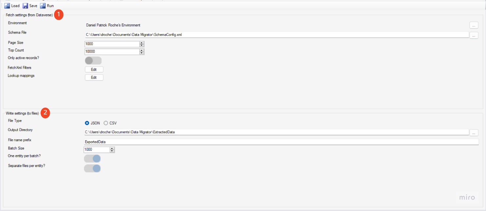
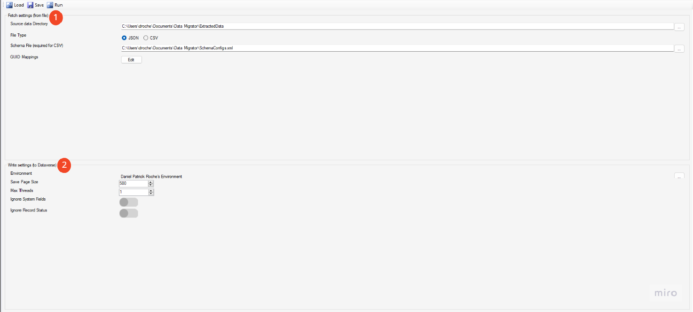

# CDS Data Migrator Guide

## Content
 - [Introduction](#Introduction)
 - [Use Cases](#Use-Cases)
 - [Installation](#Installation)
 - [Data Import and Data Export Schema Generation](#Data-Import-and-Data-Export-Schema-Generation)
 - [Export Config File](#Export-Config-File)
 - [Import Config File](#Import-Config-File)
 - [Data Export](#Data-Export)
 - [Data Import](#Data-Import) 
----

 

### Introduction
TESTThe CDS Data Migrator tool provides an easy to use interface that enables you to generate an XML schema file that can be used to export data from one CRM environment and import into another. The tool not only supports the ability to add entity attributes and many-to-many relationships to the schema, but beyond that, it supports the creation of filters and GUID mappings which are stored as .JSON file formats.

#### Video Intro 

### Use Cases
A major benefit of the CDS Data Migrator is that it has data obfuscation built in. For example, sample production data might contain confidential information such as names, email and GUIDs which should not exist in other environments. When import this data into another environment such as test or UAT then the tool can be configured to scrabble select entity fields during the import. Strings are scrabbled by replacing a value with a new value of the same length but with random characters (A-Z a-z 0-9). Numbers are scrabbled to another random number. 
If you need to move reference/configuration data from development into other environments such as test, UAT or production then this tool saves time as the configuration would only need to be done once and then can be replicated in other environments seamlessly using the tool. This includes entities such as Calendars, Business Units, Teams, and Organisation Settings.

#### Feature Comparison
Below is a table comparing the CDS Data Migrator tool with Microsoft's.

|Feature  |MSFT Configuration Migration Tool  |CDS Data Migrator  |
|:---------|:---------:|:---------:|
|Supports attributes in schema     |         |         |
|Supports many to many relationships in schema     |         |         |
|Schema Validation     |         |         |
|Modification of existing schema     |         |         |
|Exporting of data from a single environment using schema     |         |         |
|Error logging on data export / import process   |         |         |
|Colour coded sorting applied to attributes     |         |         |
|Apply GUID Mappings included in export / import process     |         |         |
|Apply Filters included in the export / import process     |         |         |
|Ability to migrate Teams     |         |         |
|Ability to migrate Calendars     |         |         |
|Ability to migrate Business Units     |         |         |

### Installation
Before using the CDS Data Migrator, you will need to install XrmToolBox which can be downloaded from [here](https://www.xrmtoolbox.com/)

Once XrmToolBox is installed, launch it and then select the Tool Library through Configuration menu as shown below:

Then search for "CDS Data Migrator", select and **Install** it:

Once the installation has completed successfully, you will see the CDS Data Migrator listed in the Tools windows as shown below:

Click the data migrator to launch it. You will be prompted for a connection to Dynamics 365 organization as shown below:

Connect to an environment and you will be taken to the Schema Configs page as shown below:

### Data Import and Export Schema Generation
The data migrator adhere to a predefined import export schema and the tool can be used to generate the respective schema for import and export. Note that for each of these, both the JSON and CSV formats are supported. To Generate or modify a schema, please follow the steps below:

1. To generate a schema file, select the required entities and attributes combination, (in this example we are creating an xml file for Accounts although you select more than one entity)

2. Within the **Schema File Path** input, browse to a location and specify a File Name. Then select **Save**

3. Once the schema file is generated, the schema XML file will be generated at the specified location. This file will contain all selected entities and their respective selected attributes and relationships

4. Below shows an example export schema file

### Export Config File
The CDS data migrator export user interface exposes only a subset of the available configuration points for the data migration operation. Through the provision of an export configuration file, the user can have a fine grain control of the export process. When the export config is not specified then the default settings are applied. While those values are beyond the scope of this documentation, it suffices to say that the default values are expected to satisfy most data operation scenarios.

For more on the data migration config settings [see](https://github.com/Capgemini/xrm-datamigration#Usage)

1. Select **Data Export** on the ribbon which will bring you to the Export Page as shown below:
 

2. Add in Fetch and Write Settings (including a schema file if exporting to CSV) and save.
 

3. Once the export config is generated, the export JSON file will be generated at the specified location. Below is an example of the generated file
 

**NB:** Ensure the JsonFolderPath exists

### Import Config File
The CDS data migrator import user interface exposes only a subset of the available configuration points for the data migration operation. Through the provision of an import configuration file, the user can have a fine grain control of the import process. When the import config is not specified then the default settings are applied. 
For more on the data migration config settings [see](https://github.com/Capgemini/xrm-datamigration#Usage)

1. Select **Data Import** on the ribbon which will bring you to the Import Page as shown below:
 

2. Add in Fetch and Write Settings and save.
 

3. Once the import config is generated, the JSON file will be generated at the specified location. Below is an example of the generated file:
 

**NB:** Ensure the JsonFolderPath exists

### Data Export
Once all the schema and config files are downloaded the next step is to export the data.

1.	Select **Data Export** from the ribbon and select format type of JSON or CSV.

2.	Select the location to save the file.

3.	Select the location of the export config file. (Optional Step)

4.	Select the Target Connection String then select the location of the schema file.

The Data Export page should look something like this:
 

5.	Select **Run** and the data will be exported to the specified location. You will also see a success message confirming that data export is complete:
 

6.	The Data is now extracted into a JSON file which you can see an example of below: 
 

In this example 3 Account records have been extracted with the attributes ‘Account Name’, ‘Email Address’ & ‘Account Number’

### Data Import
To import the exported data into an environment, follow the instructions below

1.	Select **Data Import** from the ribbon and select format type of JSON or CSV.
 
2.	Select the location of the source data.

3.  Select the location of the import config file. (Optional Step)

4.	Select the Target Connection String then select the location of the schema file (schema is only required for CSV).

The Data Import page should look something like this:
 

4.	Select **Run** and the data will be imported into D365. You will also see a success message confirming that data import is complete:
 

5.	Review the Data in D365 
 
