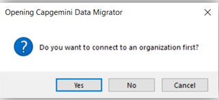

# CDS Data Migrator Guide

## Content
 - [Introduction](#Introduction)
 - [Use Cases](#Use-Cases)
 - [Installation](#Installation)
 - [Data Import and Data Export Schema Generation](#Data-Import-and-Data-Export-Schema-Generation)
 - [Export Config File](#Export-Config-File)
 - [Import Config File](#Import-Config-File)
 - [Data Export](#Data-Export)
 - [Data Import](#Data-Import) 
----

 

### Introduction
TESTThe CDS Data Migrator tool provides an easy to use interface that enables you to generate an XML schema file that can be used to export data from one CRM environment and import into another. The tool not only supports the ability to add entity attributes and many-to-many relationships to the schema, but beyond that, it supports the creation of filters and GUID mappings which are stored as .JSON file formats.

#### Video Intro 

### Use Cases
A major benefit of the CDS Data Migrator is that it has data obfuscation built in. For example, sample production data might contain confidential information such as names, email and GUIDs which should not exist in other environments. When import this data into another environment such as test or UAT then the tool can be configured to scrabble select entity fields during the import. Strings are scrabbled by replacing a value with a new value of the same length but with random characters (A-Z a-z 0-9). Numbers are scrabbled to another random number. 
If you need to move reference/configuration data from development into other environments such as test, UAT or production then this tool saves time as the configuration would only need to be done once and then can be replicated in other environments seamlessly using the tool. This includes entities such as Calendars, Business Units, Teams, and Organisation Settings.

#### Feature Comparison
Below is a table comparing the CDS Data Migrator tool with Microsoft's.

|Feature  |MSFT Configuration Migration Tool  |CDS Data Migrator  |
|:---------|:---------:|:---------:|
|Supports attributes in schema     |         |         |
|Supports many to many relationships in schema     |         |         |
|Schema Validation     |         |         |
|Modification of existing schema     |         |         |
|Exporting of data from a single environment using schema     |         |         |
|Error logging on data export / import process   |         |         |
|Colour coded sorting applied to attributes     |         |         |
|Apply GUID Mappings included in export / import process     |         |         |
|Apply Filters included in the export / import process     |         |         |
|Ability to migrate Teams     |         |         |
|Ability to migrate Calendars     |         |         |
|Ability to migrate Business Units     |         |         |

### Installation
Before using the CDS Data Migrator, you will need to install XrmToolBox which can be downloaded from [here](https://www.xrmtoolbox.com/)

Once XrmToolBox is installed, launch it and then select the Tool Library through Configuration menu as shown below:

Then search for "CDS Data Migrator", select and **Install** it:

Once the installation has completed successfully, you will see the CDS Data Migrator listed in the Tools windows as shown below:

Click the data migrator to launch it. You will be prompted for a connection to Dynamics 365 organization as shown below:

Connect to an environment and you will be taken to the CDS Migrator landing page as shown below:

### Data Import and Data Export Schema Generation
The data migrator adhere to a predefined import export schema and the tool can be used to generate the respective schema for import and export. Note that for each of these, both the JSON and CSV formats are supported. To Generate or modify an export schema, please follow the steps below:

1.	Select **Generate/Modify Export Schema** from the Schema Config tab of the data migrator and then select **Next**

2.	Select the required entities and attributes combination, (in this example we are creating a xml file for Accounts & Contacts)

3.	Within the **Schema File Path** input, browse to a location and specify a File Name. Then select **Save**

4.	The next step is to **Save** the schema as shown below:
 

5.	Once the export schema is generated, a "Successfully created XML file" dialog will pop up and the export schema XML file will be generated at the specified location. This file will contain all selected entities and their respective selected attributes and relationships

 

 

### Export Config File
The CDS data migrator export user interface exposes only a subset of the available configuration points for the data migration operation. Through the provision of an export configuration file, the user can have a fine grain control of the export process. When the export config is not specified then the default settings are applied. While those values are beyond the scope of this documentation, it suffices to say that the default values are expected to satisfy most data operation scenarios.

For more on the data migration config settings [see](https://github.com/Capgemini/xrm-datamigration#Usage)

1.	Select **Generate/Modify Export Config** from the Schema Config tab of the data migrator and then select **Next**
 

2.	Select the entities and the attributes and then in the **Export Config** browse to a location and input a File Name (in this example we are creating a xml file for Accounts & Contacts), then select **Save**
 

3.	Save the Export Config
 

4.	Once the export config is generated, a "Successfully created XML file" dialog will pop up and the export JSON file will be generated at the specified location. Below is an example of the generated file
 

**NB:** Ensure the JsonFolderPath exists

### Import Config File
The CDS data migrator import user interface exposes only a subset of the available configuration points for the data migration operation. Through the provision of an import configuration file, the user can have a fine grain control of the import process. When the import config is not specified then the default settings are applied. 
For more on the data migration config settings [see](https://github.com/Capgemini/xrm-datamigration#Usage)

1.	Select **Generate/Modify Import Config** from the Schema Config tab of the data migrator and then select **Next**
 

2.	Select the entities and the attributes and then in the **Import Config** browse to a location and input a File Name (in this example we are creating a xml file for Accounts and Contact), then select **Save**
 

3.	Save the Import Config
 

4.	Once the import config is generated, a "Successfully created XML file" dialog will pop up and the export JSON file will be generated at the specified location. Below is an example of the generated file
 

**NB:** Ensure the JsonFolderPath exists

### Data Export
Once all the schema and config files are downloaded the next step is to export the data. 
1.	Select **Data Export** from the ribbon and select format type of JSON or CSV, then select **Next**
 

2.	Select the location to save the file and then click **Next**
 

3.	Select the location of the export config file then select Next. (Optional Step)
 

4.	Select the Target Connection String then select the location of the schema file then click **Next**
 

5.	On this screen select **Execute** and the data will be exported to the specified location:
 

6.	The Data is now extracted into a JSON file/s which you can see an example of below: 
 

In this example 3 Account records have been extracted with the attributes ‘Account Name’, ‘Email Address’ & ‘Account Number’

### Data Import
To import the exported data into an environment, follow the instructions below
1.	Select **Data Import** from the ribbon and select format type of JSON or CSV, then select **Next**
 
 
2.	Select the location where the source data is stored and select **Next**
 
 
In this example accounts and contacts will be imported at the same time.
 

3.	The next screen requests an Import Config file (Optional Step)
  

4.	The final step is to Execute the import. The Log will show the progress of the import and notify the user if there are any issues/errors
 

5.	Review the Data in D365 
 
 
